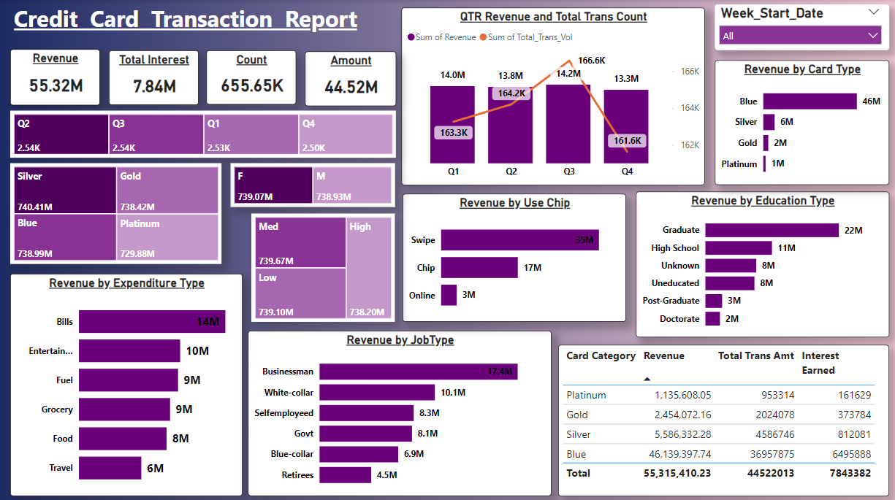
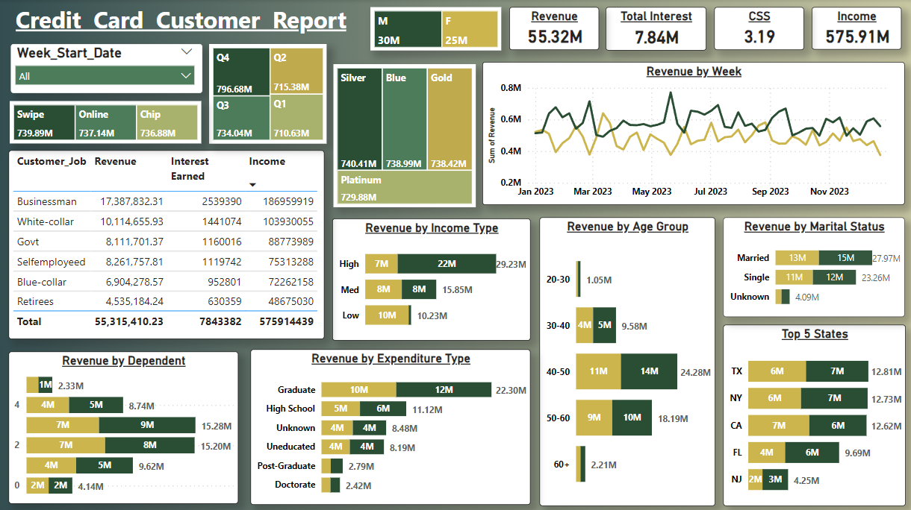

# Credit Card Transaction and Customer Insights

## Overview

This document provides an analysis of credit card transaction and customer reports, highlighting key insights and trends.

## Insights

### Card Usage and Revenue Distribution
- **Blue Card Users**: Largest contributors to total revenue, indicating higher acceptance or preferential use.
- **Platinum and Gold Cards**: Though fewer in usage, they generate significant interest, suggesting higher average balances or transaction sizes.

### Customer Demographics and Revenue
- **Job Type**: Businessmen and white-collar workers are the top contributors in terms of revenue, likely reflecting higher spending power or credit card usage habits.
- **Age Groups**: The 30-50 age group dominates revenue generation, likely due to peak earning years and increased spending on services and goods.

### Transaction Method Preferences
- **Swipe Transactions**: Dominate over chip and online methods by a large margin, indicating user comfort with traditional methods and areas for growth in digital transaction adoption.

### Customer Financial Profiles
- **High-Income Individuals**: Contribute substantially more to revenue compared to medium and low-income brackets, highlighting a core demographic that could be targeted for premium services.

### Dependents and Spending
- Customers with **two dependents** show the highest revenue contribution, possibly due to higher financial responsibilities or lifestyle costs influencing credit card usage.

### Marital Status and Spending Patterns
- **Married Customers**: Generate more revenue than single or unknown marital statuses, potentially due to combined family expenses or dual-income advantages.

### Expenditure Type by Education
- **Graduates**: Lead in expenditure types, followed closely by those with a high school education, suggesting that educational attainment may correlate with spending patterns and financial literacy or income levels.

## Visual Insights

*Figure 1: Card Usage and Revenue Distribution*

*Figure 2: Customer Demographics and Revenue*

## Conclusion

This analysis provides valuable insights into credit card usage patterns, customer demographics, and spending behaviors. By understanding these trends, financial institutions can better tailor their services to meet customer needs and optimize revenue generation.

