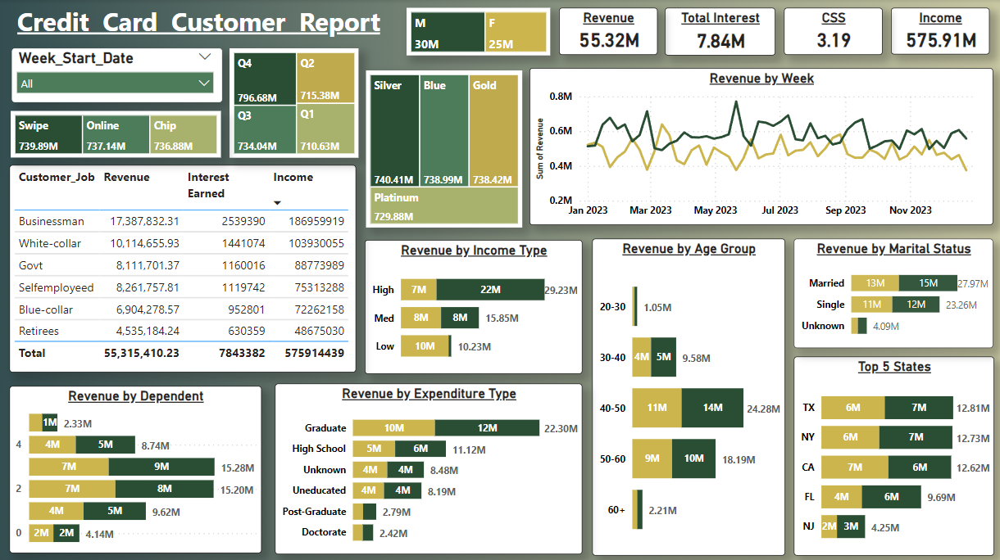

# Credit Card Transaction and Customer Insights
- This Power BI dashboard provides real-time insights into credit card transactions and customer data.
  
## Transaction Report Insights

### Dominance of Blue Cards
- **Revenue Generation**: Blue cards generate the highest revenue at **46M**, contributing significantly to the total revenue of **55M**.
- **Transaction Amount**: They lead in total transaction amount with **37M**.
- **Interest Earned**: Blue cards also have the highest interest earned at **6.5M**, indicating their widespread usage and profitability.

### Expenditure Categories
- **Top Revenue Generators**:
  - Bills: **14M**
  - Entertainment: **10M**
  - Fuel and Grocery: **9M** each
- These categories highlight essential and leisure expenses as key revenue drivers.

### User Segmentation by Education and Job
- **Education**: Graduates contribute the highest revenue at **22M**, indicating significant purchasing power.
- **Job**: Businessmen lead in terms of revenue generation with **17M**, followed by white-collar workers at **10M**.

### Transaction Methods
- **Swipe Transactions**: Dominate with **35M** in revenue.
- **Chip Transactions**: **17M**
- **Online Transactions**: **3M**
- This indicates a preference for physical card usage over online transactions.

### Quarterly Trends
- **Q3 Peak**: Highest revenue at **14.2M** and transaction count at **166.6K**.
- **Q4 Decline**: Observed decrease in both revenue and transaction count.
- Monitoring these trends can help in planning promotions and offers.

## Customer Report Insights

### Weekly Revenue Fluctuations
- Revenue shows noticeable peaks and troughs throughout the year.
- Understanding these patterns can aid in forecasting and strategizing for high-revenue periods.

### Age Group Contribution
- **30-50 Age Group**: Contributes the most revenue at **41M**, indicating a financially active demographic.
- Both men and women in this age range show significant spending, with males leading slightly.

### Job and Income Analysis
- **Highest Revenue Generators**: Businessmen and white-collar workers.
- **Income Levels**: High-income individuals contribute **22M**, while low-income groups generate **10M**, highlighting diverse spending capacities.

### Geographic Insights
- **Top States**: CA, NY, and TX each generate around **6-7M** in revenue.
- Targeting marketing efforts in these regions could further enhance revenue.

### Dependents and Marital Status
- **Married Individuals**: Contribute the highest revenue at **15M**, followed by single individuals at **12M**.
- Households with two dependents show the highest revenue contribution, suggesting targeted offers for families.

### Expenditure by Education
- **Graduates and Post-Graduates**: Show the highest spending with revenue contributions of **22M** and **10M** respectively.
- Investing in loyalty programs for educated consumers might yield higher returns.

## Strategic Insights for Optimization

1. **Focus on Blue Card Promotions**: Given the dominance of Blue cards, marketing and rewards programs centered around this card type can maximize returns.
2. **Encourage Swipe Transactions**: With swipe transactions leading in revenue, enhancing security and convenience for physical card usage could sustain this trend.
3. **Target Key Demographics**: Concentrate efforts on the 30-50 age group, businessmen, and high-income individuals, as they are the highest spenders.
4. **Regional Marketing Campaigns**: States like CA, NY, and TX should be primary targets for regional campaigns due to their high revenue contributions.
5. **Seasonal Offers and Promotions**: Align promotional activities with quarterly revenue trends, particularly in Q3, to capitalize on peak spending periods.

## Visual Insights

*Figure 1: Card Usage and Revenue Distribution*

*Figure 2: Customer Demographics and Revenue*

